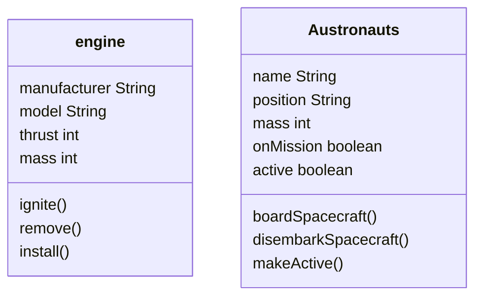

```mermaid
classDiagram
    class engine{
        manufacturer String
        model String
        thrust int
        mass int
        ignite()
        remove()
        install()
    }

    class Austronauts{
        name String
        position String
        mass int
        onMission boolean
        active boolean
        boardSpacecraft()
        disembarkSpacecraft()
        makeActive()
    }

```